# Logon

Logon will be simple, enter email, that get's checked and a time sensitive link is emailed, which causes a cookie to be sent to the user.

# Basic features

1. Logon from cold
2. Logoff self
3. Logoff user by email (admin only)
4. Logoff everyone

# UI

```text
I agree to having my details stored for club use < Y/N>
email: <email@example.com>
[send link]
```

# Time sensitive link

# Sequence

Login is performed without a password, just a link

```mermaid
---
title: Login
---
sequenceDiagram
    actor user
    participant login_page
    participant token_link
    autonumber

    rect rgb(64,1,1)
        user->>login_page: view login
        user->>login_page: submit email
        login_page->>DB: check registered user
        opt not registered
            login_page-->>user: return holding page
        end
        alt already logged in
            login_page->>DB: extend cookie
            login_page-->>user: redirect to profile (with cookie)
        else
            login_page->>login_page: generate random token
            login_page->>DB: store token
            login_page->>SMTP: send token
            login_page-->>user: return holding page
        end
    end

    rect rgb(1, 64,1)
        user->>token_link: clicked from email
        token_link->>DB: check token
        token_link->>token_link: generate cookie (encrypt: user_id, name, role)
        token_link->>DB: store cookie
        token_link-->>user: redirect to profile (with cookie)
    end
```


